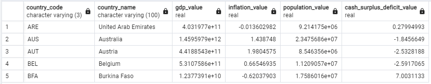

<h1> World Economic Data </h1>

#### TOC

I. About the Data<br>
II. Inserting the above Data into a Database<br>
III. Create a Parent Table and Create a One to Many Relations With the Rest of the Tables<br>
IV. Create a Minimal Role Called world_data_user<br>
V. Analyze Tables<br>
VI. Get Memory Usage for each Table<br>
***

<h2> I. About the Data </h2>
Data source: <a href="https://datahub.io/collections/economic-data">https://datahub.io/collections/economic-data</a>

The data are available in separate files:

- **GDP** - Country, Regional and World GDP (Gross Domestic Product).
  
  

- **CPI** - Annual Consumer Price Index (CPI) for most countries in the world.
  
  

- **Inflation** - Annual inflation by GDP deflator and consumer prices.
  
  

- **Population** - Population figures for countries, regions (e.g. Asia) and the world.
  
  

- **Cash Surplus Deficit** - Cash Surplus/Deficit, in % of GDP, from 1990 to 2013.
  
  

***

In the above tables, we see that each table has the same column called **Country Name** and the corresponding **Country Code** and **year**.  

To relate each table, I create two new tables called country and year, respectively. 

<h2>II. Inserting the above Data into a Database </h2>
Each data is stored in its own table. The set of tables are stored within a schema called economic_data, which resides within a database called World_Data. The World_Data database can contain many schemas in which related tables are stored. We create schemas to separate different categories of information to simplify database maintenance.

_Create a Database_

1. Run pg_admin server. It may take several attempts to successfully connect to the server.
2. In the browser window, expand the PostgreSQL menu to display the Databases menu.
3. Right click on the Databases menu and click Create -> Database... 
4. Name it World_Data and click Save.

_Create a Schema_
Isolate related tables within a separate schema

1. Expand the newly created World_Data table and right click on the Schemas menu -> Create -> Schema...  
2. Name it economic_data and click Save.

_Create Tables_

1. Right click on then newly created economic_data table (located within: Databases -> World_Data -> Schemas -> economic_data) and click on Query Tool.
2. Type the following commands to create the tables corresponding tables to each of the above csv files.

I don't use a capitalized name for the schema (i.e., 'economic_data' instead of 'Economic_Data') because it otherwise triggered an error.

```
--1. GDP
CREATE TABLE economic_data.GDP(
    country_name varchar(100),
    country_code varchar(3),
    years integer,
    gdp_value float(24)
);

--2. CPI
CREATE TABLE economic_data.CPI(
    country_name varchar(100),
    country_code varchar(3),
    years integer,
    cpi_value float(24)
);

--3. Inflation
CREATE TABLE economic_data.Inflation(
    country_name varchar(100),
    country_code varchar(3),
    years integer,
    inflation_value float(24)
);

--4. Population
CREATE TABLE economic_data.Population(
    country_name varchar(100),
    country_code varchar(3),
    years integer,
    population_value float(24)
);

--5. Cash Surplus Deficit
CREATE TABLE economic_data.Cash_Surplus_Deficit(
    country_name varchar(100),
    country_code varchar(3),
    years integer,
    cash_surplus_deficit_value float(24)
);
```

Next, populate the newly created tables with data from the respective csv files.

```
/*To overcome permission denied error:
Right click on the file or folder containing the csv files -> Properties. 
Go to Security tab -> Edit  -> Add. Type 'Everyone'
(without apostrophe) inside the box an click Apply.

--NOTE: You will need to specify the absolute path to the csv file on your computer to be found by postgresql.
*/
--1. GDP
COPY economic_data.GDP
FROM 'gdp_csv.csv' 
DELIMITER ',' 
CSV HEADER;

--2. CPI
COPY economic_data.CPI
FROM 'cpi_csv.csv' 
DELIMITER ',' 
CSV HEADER;

--3. Inflation
COPY economic_data.inflation
FROM 'inflation-gdp_csv.csv' 
DELIMITER ',' 
CSV HEADER;

--4. Population
COPY economic_data.population
FROM 'population_csv.csv' 
DELIMITER ',' 
CSV HEADER;

--5.
COPY economic_data.cash_surplus_deficit
FROM 'cash-surp-def_csv.csv' 
DELIMITER ',' 
CSV HEADER;
```

To see the newly created tables on postgresql, right click on the World_Data database menu and click on refresh.

<h2>III. Create a Parent Table and Create a One to Many Relations With the Rest of the Tables </h2>

Extract the unique country codes and country names from the newly created tables. Use these columns to make a new table in which country name is the primary key, since I found that the country codes are not unique.

```
/*
III. Create a parent table and create a one to many relations with the rest of the tables 
*/
--A. get DISTINCT country_code and country_name from all tables and create a new table called countries
CREATE TABLE economic_data.countries AS (
    SELECT DISTINCT country_code, country_name FROM economic_data.GDP
    WHERE country_code IS NOT NULL
    UNION DISTINCT
    SELECT DISTINCT country_code, country_name FROM economic_data.CPI
    WHERE country_code IS NOT NULL
    UNION DISTINCT
    SELECT DISTINCT country_code, country_name FROM economic_data.inflation
    WHERE country_code IS NOT NULL
    UNION DISTINCT
    SELECT DISTINCT country_code, country_name FROM economic_data.population
    WHERE country_code IS NOT NULL
    UNION DISTINCT
    SELECT DISTINCT country_code, country_name FROM economic_data.cash_surplus_deficit
    WHERE country_code IS NOT NULL
);

--Make country name the primary key to maintain its uniqueness
--When I tried to make the country_name unique, I received an Error message and found a duplicate.
```

Delete a duplicated country name, 'Kosovo', but with a different country_code, 'XKX'.

```
SELECT * 
FROM economic_data.countries
WHERE country_name='Kosovo';

--delete duplicated country_name
DELETE FROM economic_data.countries 
WHERE country_code='XKX';
```

Having deleted the duplicate country_name, I can then turn the country_name column into a unique column and make it the primary key.

```
--Make sure than the country_name columns is unique and turn it into a primary key column
ALTER TABLE economic_data.countries
ADD UNIQUE (country_name);

ALTER TABLE economic_data.countries
ADD PRIMARY KEY (country_name);
```

Finally, relate the newly created countries table to the rest of the tables via the country_name foreign key.

```
--B. Relate countries table to the rest of the table via a foreign key
ALTER TABLE economic_data.GDP
ADD FOREIGN KEY (country_name)
REFERENCES economic_data.countries(country_name);

ALTER TABLE economic_data.CPI
ADD FOREIGN KEY (country_name)
REFERENCES economic_data.countries(country_name);

ALTER TABLE economic_data.inflation
ADD FOREIGN KEY (country_name)
REFERENCES economic_data.countries(country_name);

ALTER TABLE economic_data.population
ADD FOREIGN KEY (country_name)
REFERENCES economic_data.countries(country_name);

ALTER TABLE economic_data.cash_surplus_deficit
ADD FOREIGN KEY (country_name)
REFERENCES economic_data.countries(country_name);
```

Next, let's review the most recent year in each table and find the minimum year. I found the minimum year to be 2014.

```
/*
--Get the minimum year
--C. Check the time it takes for sql to get minimum years from all columns
     without indexing
*/

EXPLAIN ANALYZE
WITH temporary_column AS(
SELECT MAX(years) AS years
FROM economic_data.GDP
UNION
SELECT MAX(years) AS years
FROM economic_data.CPI
UNION
SELECT MAX(years) AS years
FROM economic_data.inflation
UNION
SELECT MAX(years) AS years
FROM economic_data.population
UNION
SELECT MAX(years) AS years
FROM economic_data.cash_surplus_deficit
)

SELECT MIN(years)
FROM temporary_column;

--The data of the most recent year that is available from all tables is 2014.
```

As an exercise, I set the years column in each table as an index and assessed using the EXPLAIN ANALYZE method if the search time for the minimum year would be any faster. The result was inconclusive because each time I executed the query, the calculated time varied widely.  

```
/*
--D. Indexing the years on each table did not seem to improve the query time.
I also noticed that the query times varied each time the query is executed.

Note that the insertion operation of an indexed table is slow. Also,
improperly indexed table can slow down SELECT queries.
*/

CREATE INDEX years_idx ON economic_data.GDP(years);
CREATE INDEX years_idx ON economic_data.CPI(years);
CREATE INDEX years_idx ON economic_data.inflation(years);
CREATE INDEX years_idx ON economic_data.population(years);
CREATE INDEX years_idx ON economic_data.cash_surplus_deficit(years);

EXPLAIN ANALYZE
WITH temporary_column AS(
SELECT MAX(years) AS years
FROM economic_data.GDP
UNION
SELECT MAX(years) AS years
FROM economic_data.CPI
UNION
SELECT MAX(years) AS years
FROM economic_data.inflation
UNION
SELECT MAX(years) AS years
FROM economic_data.population
UNION
SELECT MAX(years) AS years
FROM economic_data.cash_surplus_deficit
)

SELECT MIN(years)
FROM temporary_column;
```

Below shows an example output of the EXPLAIN ANALYZE query.

</img>

<h2>IV. Create a Minimal Role Called world_data_user</h2>

To secure the database, I created a user called world_data_user who can only perform the EXECUTE method.

```
--IV. Create a minimal role called world_data_user
CREATE ROLE world_data_user WITH NOSUPERUSER LOGIN;
--this line is required
GRANT USAGE ON SCHEMA economic_data TO world_data_user;
GRANT SELECT ON ALL TABLES IN SCHEMA economic_data TO world_data_user;
```

I could verify the world_data_user privileges as follows.

```
--check privileges
SELECT grantee, table_name, privilege_type
FROM information_schema.table_privileges
WHERE grantee='world_data_user';
```

The output is as follows.

</img>

<h1>V. Analyze Tables</h1>
Let's now analyze the tables as a world_data_user. We first switch the role.

```
--Test
SET role world_data_user;

/*
--To optionally change role back to postgres
--SET ROLE postgres;
*/
```

First, let's join countries table with the rest of the tables for the year 2014.

```
--A. Join countries table with the rest of the tables for the most recent year that is available: 2014 

--EXPLAIN ANALYZE
SELECT economic_data.countries.country_code, 
        economic_data.countries.country_name,
        economic_data.GDP.gdp_value, 
        economic_data.inflation.inflation_value,
        economic_data.population.population_value,
        economic_data.cash_surplus_deficit.cash_surplus_deficit_value

FROM economic_data.countries
    JOIN economic_data.GDP
    ON economic_data.countries.country_name=economic_data.GDP.country_name
    JOIN economic_data.CPI
    ON economic_data.countries.country_name=economic_data.CPI.country_name
    JOIN economic_data.inflation
    ON economic_data.countries.country_name=economic_data.inflation.country_name
    JOIN economic_data.population
    ON economic_data.countries.country_name=economic_data.population.country_name
    JOIN economic_data.cash_surplus_deficit
    ON economic_data.countries.country_name=economic_data.cash_surplus_deficit.country_name
WHERE economic_data.GDP.years=2014 
    AND economic_data.CPI.years=2014
    AND economic_data.inflation.years=2014
    AND economic_data.population.years=2014
    AND economic_data.cash_surplus_deficit.years=2014
ORDER BY economic_data.countries.country_code ASC
LIMIT 5;
```

Here is the output.
</img>

Next, let's join all of the children tables for 'United States' for all matching years. 

```
--B. Join all tables by year for a specific country

--First, know the right keywords
SELECT *
FROM economic_data.GDP
WHERE economic_data.GDP.country_name LIKE '%States%'
LIMIT 5;

--Select economic data for United states over time
SELECT economic_data.GDP.country_code, 
        economic_data.GDP.country_name,
        economic_data.GDP.years,
        economic_data.GDP.gdp_value, 
        economic_data.inflation.inflation_value,
        economic_data.population.population_value,
        economic_data.cash_surplus_deficit.cash_surplus_deficit_value

FROM economic_data.GDP
    JOIN economic_data.CPI
    ON economic_data.GDP.years=economic_data.CPI.years
    JOIN economic_data.inflation
    ON economic_data.GDP.years=economic_data.inflation.years
    JOIN economic_data.population
    ON economic_data.GDP.years=economic_data.population.years
    JOIN economic_data.cash_surplus_deficit
    ON economic_data.GDP.years=economic_data.cash_surplus_deficit.years
WHERE economic_data.GDP.country_name='United States'
    AND economic_data.CPI.country_name='United States'
    AND economic_data.inflation.country_name='United States'
    AND economic_data.population.country_name='United States'
    AND economic_data.cash_surplus_deficit.country_name='United States'

ORDER BY economic_data.GDP.years DESC
LIMIT 15;
```

Here is the output.
</img>

<h1>VI. Get Memory Sizes</h1>

As a final exercise, I reviewed the memory usage for each table with the following query. 

```
--VI. Get Memory Usage for each Table
/*SELECT pg_size_pretty(pg_table_size('economic_data')) AS tbl_size, 
pg_size_pretty(pg_indexes_size('economic_data')) AS idx_size, 
pg_size_pretty(pg_total_relation_size('economic_data')) AS total_size;
*/

SELECT pg_size_pretty(pg_relation_size('economic_data.countries'))
UNION
SELECT pg_size_pretty(pg_relation_size('economic_data.GDP'))
UNION
SELECT pg_size_pretty(pg_relation_size('economic_data.CPI'))
UNION
SELECT pg_size_pretty(pg_relation_size('economic_data.inflation'))
UNION
SELECT pg_size_pretty(pg_relation_size('economic_data.population'))
UNION
SELECT pg_size_pretty(pg_relation_size('economic_data.cash_surplus_deficit'));

--clean cache by restarting when you see postgresql acting weird
```

The output is as follows.<br>
</img>

***
